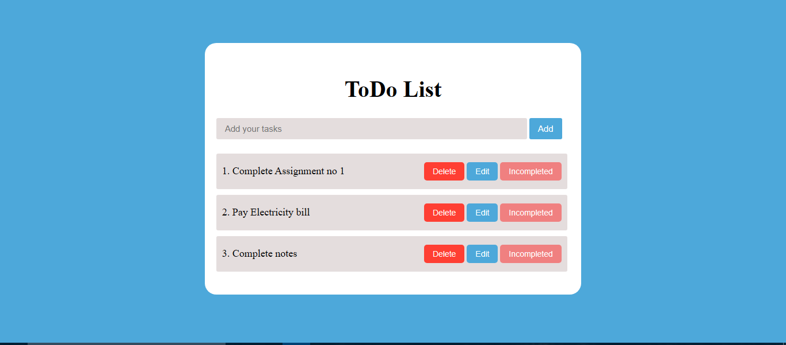

# ✅ To-Do List Web App

A sleek and simple **To-Do List App** built using **HTML**, **CSS**, and **JavaScript**. Users can add, mark as complete, **edit**, and delete tasks with all data saved using `localStorage`.

---

## 🌐 Live Demo

🔗 [Try it Live]( https://mubeen2005.github.io/To-Do-List/)  

---

## 🖼️ Preview

  

---

## 🧰 Tech Stack

- 🧱 **HTML5** – Structure and layout
- 🎨 **CSS3** – Responsive and clean styling
- ⚙️ **JavaScript (Vanilla)** – App logic, interactivity, and storage

---

## ✨ Features

- ➕ Add new tasks
- 📝 **Edit existing tasks**
- ✅ Mark tasks as completed/incomplete
- 🗑️ Delete individual tasks
- 💾 Saves tasks to **localStorage**
- ♻️ Clear all tasks option
- 📱 Fully responsive design

